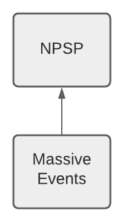
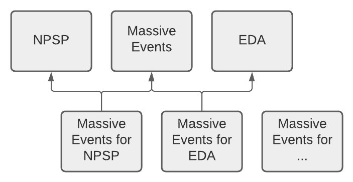

+++
title="The Bridge Package Pattern"
aliases=["2022/02/11/bridge-package-pattern.html"]
+++

Managing your package architecture for a Salesforce platform product is a major challenge not because it's difficult as such, but because in many cases your decisions must be made very early in the lifecycle of the product and are very difficult or even impossible to change. This challenge is especially prominent when designing extension packages, which build upon existing managed packages. The bridge package pattern is a package architecture that factors dependency into a tiny, minimal second package whose only job is connecting two other packages that are independent of one another. Think of it like a junction object for managed packages.

The bridge package pattern can be counterintuitive, but offers long-term value. We'll explore it through an example product called Massive Events.

## Managed Packages and Dependencies

Understanding the value of the bridge package pattern requires that we get into the weeds of managed package dependency and manageability rules. Let's dig in to how this plays out in the journey of Massive Events from product design to delivery. 

At Massive Events, you're building a new managed package product to help organize galas, fundraising events, and classes. Integration with the Nonprofit Success Pack (NPSP) is a key objective for your product: nonprofit customers will need to connect event income to General Accounting Units, apply Action Plans to event attendees, and cultivate participants through a donor pipeline. 

Naturally, you envision your product as an _extension package_ of NPSP. An extension package includes components that directly reference components of another ("core") package, meaning that installation of the extension package will always require the core package. Massive Events will add schema to NPSP objects, establish relationships between Massive Events objects and NPSP objects, and call `global` methods in NPSP's Apex classes. Here's what the package architecture looks like (arrows denote the direction of dependencies).

This design is _not wrong_. Extending managed packages to provide new functionality is a common and valuable strategy for developing an AppExchange product; it encourages end users to compose multiple products to cover the full breadth of their needs. But here's the low-level technical blocker that can ultimately make this architectural choice dangerous: _in a subset of cases that is challenging to define completely, it is impossible to remove a dependency between an extension package and its core package_. 

The dependency between Massive Events and NPSP is established by the points of connection between components we mentioned above. When Massive Events Apex calls NPSP Apex, that's a dependency. Likewise, when Massive Events adds schema to NPSP objects or references those objects in its own schema, another dependency is created. Once those component-to-component dependencies exist, they're under the control of the _manageability rules_ applied to the components in the extension package that reference the core package. If manageability rules don't allow the package developer to change or delete the component that contains the cross-package reference, the dependency is permanent. 

The upshot of all this is that Massive Events may _always_ require the Nonprofit Success Pack, in every customer org. And whether or not that's the case is determined by innocuous technical decisions made during implementation, like whether or not to reference an NPSP component in a Flow (which cannot be deleted).

Massive Events might say "So what? We're a nonprofit-focused product; requiring NPSP is not a problem for our package". And that's fine too, but it's a long-term business risk that the company must evaluate. What if their clients start asking to buy Massive Events for EDA? Or Massive Events for a vanilla Sales Cloud org? Massive Events could be leaving long-term revenue on the table by designing their package in a way that won't allow them to pivot, or incurring significant costs if they need to maintain multiple copies of the same codebase to support these divergent customer bases.

## The Bridge Package Pattern

The solution to this challenge is the _bridge package pattern_. It's a way of structuring the application into packages in a way that allows Massive Events to isolate their dependency on NPSP from the core functionality of their package into a separate _bridge_, leaving the door open to later pivoting the core application to support other types of Salesforce org.

The package structure for Massive Events would look like this under the bridge package approach. Again, arrows denote the direction of dependency relationships.

Massive Events itself has _no_ dependencies, and contains only the core functionality of the application. The Massive Events NPSP Bridge package contains all of the components of the application that reference NPSP. The bridge package depends on both NPSP and the Massive Events core package.

Dividing package functionality into a core and a bridge can seem unnatural, especially for products that are deeply connected to the package to which you wish to bridge. In some cases, your core package won't be functional by itself: it will require at least one bridge package. For example, the Massive Events Flows we mentioned above require NPSP, and without them, some of Massive Events' functionality may not work at all. A Massive Events customer would need to install the core Massive Events package _plus_ the NPSP bridge, or the EDA bridge, or a "bridge" for vanilla Sales Cloud, since those Flows cannot live in the core package. 

Similarly, an NPSP extension like Massive Events might need to _either_ interoperate with the NPSP Table Driven Trigger Management framework _or_ use its own trigger framework if NPSP is not present. As the package architect, you could site the TDTM integration in the NPSP bridge, and either ship the Massive Events trigger framework in a Sales Cloud bridge or include it in the core application with a feature flag to inactivate it when NPSP is present. Both frameworks would call the same Apex classes in the core application to execute work, leaving mostly glue code in the bridges. That strategy reduces code duplication and helps keep the configuration space of the package as small as possible, benefiting not only developers but also the support staff who handle customer cases.

In this architecture, the Massive Events core package includes as much of the application schema as possible. This decision is particularly helpful for API consumers and integrated applications: regardless of the shape of the org overall, API clients like data loaders and enterprise services can rely on the Massive Events schema having the same shape. Relationships between Massive Events schema and NPSP objects, and fields added by Massive Events to NPSP, live in bridge packages.

A great example of the bridge package pattern is [Outbound Funds Module](https://github.com/SalesforceFoundation/OutboundFundsModule) (OFM). OFM helps organizations that disburse grant funds track their operations. It supports the Nonprofit Success Pack, but doesn't require it, because it's structured with a bridge package just like the one shown above for Massive Events. Since Outbound Funds Module is open source, you can check out how both it and its [NPSP bridge package](https://github.com/SalesforceFoundation/OutboundFundsModuleNPSP) are designed.

## Adding Bridges Later

Earlier, we noted that

> ... in a subset of cases that is challenging to define completely, it is impossible to remove a dependency between an extension package and its core package.

There _are_ situations where removing this dependency is possible. I've done it in a production package! Whether or not it's possible is highly situation-dependent, and the procedure for executing the removal can impact current customers.

Fundamentally, if manageability rules allow you to remove the component(s) that establish the dependency from your package, or alter them to remove the dependency from the component, you can drop the package-to-package dependency. There are numerous situations where that is not possible, including but by no means limited to the Flow case referenced above and situations where a cross-package Apex reference occurs in the signature of a `global` method. There are others, too, where the customer impact of such a component deletion is unacceptable: if the extension package includes a field on a core package object, deleting that field and recreating it in a bridge package instead could force customers into a data migration, and might impact integrated systems as well.

It's much easier to consider these types of changes if the package hasn't already been shipped to customers. Removing references from a Permission Set, for example, is a viable strategy to remove a managed package dependency before delivery to customers, but has moderate potential impact on existing users.

## Conclusion

If there's a single takeaway I want to offer, it's this: package architecture and dependency is worth thinking through with great care. Decisions you make at the very beginning of your application's life have long-term and potentially indelible impact. In many circumstances, making a small extra investment in package architecture can pay off in the form of the ability to pivot to new use cases and address new markets seamlessly.
