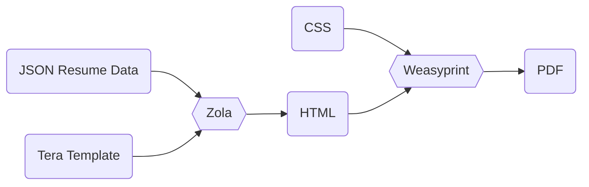

+++
title="The Overengineered Resume with Zola, Weasyprint, and Nix"
[extra.resources.repo]
link="https://github.com/davidmreed/resume-template"
+++

Maintaining a resume is not the most interesting use of time. Naturally, when I needed to bring my own up to date, I decided to spend a great deal more time on it and overengineer the process.

I wanted a bunch of things that didn't necessarily fit together that well:

- A split between content and presentation, so that I could maintain my resume data separately from how it's rendered and swap out different rendered formats.
- Version control. I wanted everything in Git, in text-based formats that I can diff or process with scripts.
- Multiple output formats, at least in theory.
  - PDF rendering, since most career sites accept PDF uploads.
  - The option to publish my resume as a web page in the future.
- More visual flair and typesetting control than basic Google Docs-style resume templates. (I know applicant-tracking systems don't see visual flair, but it makes me happy).
- Straightforward text embedding in PDFs to ensure those ATSs _do_ see what they need.
- Not to use LaTeX. It's been years since I used LaTeX in anger, and I'd prefer to stick with web technologies I know well.

Here's where I ended up.

## Building a Data-Driven Resume

I'm only aware of one standard for representing resume data: [JSON Resume](https://jsonresume.org/schema/). I always prefer to use standards where I can, although I'm disappointed there isn't a stronger ecosystem around this one. I decided to use JSON Resume to store my resume data.

Because I wanted to avoid LaTeX, I decided to try templating my resume data into either Markdown or HTML and CSS and then rendering that content as a PDF. That also gave me the optionality I was looking for on output formats; if I wanted a resume web page, I could just publish the HTML with a different stylesheet.

I already use the static site generator [Zola](https://www.getzola.org/) to build this website. Zola's Tera template engine is very similar to Jinja2, making it comfortable for me, and it's very fast.

The HTML-to-PDF tool space doesn't have a huge number of players in it and most of the players seem to be eccentric in some respect. I've played with this kind of rendering in the past and had some success with [Weasyprint](https://weasyprint.org/), so I brought it back for this effort.

Here's how these components come together into a data-to-PDF pipeline:

<div style="display: none;">
<!-- hidden Mermaid until we do dynamic rendering -->



</div>

<svg id="mermaid-svg" width="100%" xmlns="http://www.w3.org/2000/svg" style="max-width: 634.609375px;" viewBox="-8 -8 634.609375 176" role="graphics-document document" aria-roledescription="flowchart-v2" xmlns:xlink="http://www.w3.org/1999/xlink"><style>#mermaid-svg{font-family:"trebuchet ms",verdana,arial,sans-serif;font-size:16px;fill:#333;}#mermaid-svg .error-icon{fill:#552222;}#mermaid-svg .error-text{fill:#552222;stroke:#552222;}#mermaid-svg .edge-thickness-normal{stroke-width:2px;}#mermaid-svg .edge-thickness-thick{stroke-width:3.5px;}#mermaid-svg .edge-pattern-solid{stroke-dasharray:0;}#mermaid-svg .edge-pattern-dashed{stroke-dasharray:3;}#mermaid-svg .edge-pattern-dotted{stroke-dasharray:2;}#mermaid-svg .marker{fill:#333333;stroke:#333333;}#mermaid-svg .marker.cross{stroke:#333333;}#mermaid-svg svg{font-family:"trebuchet ms",verdana,arial,sans-serif;font-size:16px;}#mermaid-svg .label{font-family:"trebuchet ms",verdana,arial,sans-serif;color:#333;}#mermaid-svg .cluster-label text{fill:#333;}#mermaid-svg .cluster-label span,#mermaid-svg p{color:#333;}#mermaid-svg .label text,#mermaid-svg span,#mermaid-svg p{fill:#333;color:#333;}#mermaid-svg .node rect,#mermaid-svg .node circle,#mermaid-svg .node ellipse,#mermaid-svg .node polygon,#mermaid-svg .node path{fill:#ECECFF;stroke:#9370DB;stroke-width:1px;}#mermaid-svg .flowchart-label text{text-anchor:middle;}#mermaid-svg .node .label{text-align:center;}#mermaid-svg .node.clickable{cursor:pointer;}#mermaid-svg .arrowheadPath{fill:#333333;}#mermaid-svg .edgePath .path{stroke:#333333;stroke-width:2.0px;}#mermaid-svg .flowchart-link{stroke:#333333;fill:none;}#mermaid-svg .edgeLabel{background-color:#e8e8e8;text-align:center;}#mermaid-svg .edgeLabel rect{opacity:0.5;background-color:#e8e8e8;fill:#e8e8e8;}#mermaid-svg .labelBkg{background-color:rgba(232, 232, 232, 0.5);}#mermaid-svg .cluster rect{fill:#ffffde;stroke:#aaaa33;stroke-width:1px;}#mermaid-svg .cluster text{fill:#333;}#mermaid-svg .cluster span,#mermaid-svg p{color:#333;}#mermaid-svg div.mermaidTooltip{position:absolute;text-align:center;max-width:200px;padding:2px;font-family:"trebuchet ms",verdana,arial,sans-serif;font-size:12px;background:hsl(80, 100%, 96.2745098039%);border:1px solid #aaaa33;border-radius:2px;pointer-events:none;z-index:100;}#mermaid-svg .flowchartTitleText{text-anchor:middle;font-size:18px;fill:#333;}#mermaid-svg :root{--mermaid-font-family:"trebuchet ms",verdana,arial,sans-serif;}</style><g><marker id="flowchart-pointEnd" class="marker flowchart" viewBox="0 0 10 10" refX="10" refY="5" markerUnits="userSpaceOnUse" markerWidth="12" markerHeight="12" orient="auto"><path d="M 0 0 L 10 5 L 0 10 z" class="arrowMarkerPath" style="stroke-width: 1; stroke-dasharray: 1, 0;"></path></marker><marker id="flowchart-pointStart" class="marker flowchart" viewBox="0 0 10 10" refX="0" refY="5" markerUnits="userSpaceOnUse" markerWidth="12" markerHeight="12" orient="auto"><path d="M 0 5 L 10 10 L 10 0 z" class="arrowMarkerPath" style="stroke-width: 1; stroke-dasharray: 1, 0;"></path></marker><marker id="flowchart-circleEnd" class="marker flowchart" viewBox="0 0 10 10" refX="11" refY="5" markerUnits="userSpaceOnUse" markerWidth="11" markerHeight="11" orient="auto"><circle cx="5" cy="5" r="5" class="arrowMarkerPath" style="stroke-width: 1; stroke-dasharray: 1, 0;"></circle></marker><marker id="flowchart-circleStart" class="marker flowchart" viewBox="0 0 10 10" refX="-1" refY="5" markerUnits="userSpaceOnUse" markerWidth="11" markerHeight="11" orient="auto"><circle cx="5" cy="5" r="5" class="arrowMarkerPath" style="stroke-width: 1; stroke-dasharray: 1, 0;"></circle></marker><marker id="flowchart-crossEnd" class="marker cross flowchart" viewBox="0 0 11 11" refX="12" refY="5.2" markerUnits="userSpaceOnUse" markerWidth="11" markerHeight="11" orient="auto"><path d="M 1,1 l 9,9 M 10,1 l -9,9" class="arrowMarkerPath" style="stroke-width: 2; stroke-dasharray: 1, 0;"></path></marker><marker id="flowchart-crossStart" class="marker cross flowchart" viewBox="0 0 11 11" refX="-1" refY="5.2" markerUnits="userSpaceOnUse" markerWidth="11" markerHeight="11" orient="auto"><path d="M 1,1 l 9,9 M 10,1 l -9,9" class="arrowMarkerPath" style="stroke-width: 2; stroke-dasharray: 1, 0;"></path></marker><g class="root"><g class="clusters"></g><g class="edgePaths"><path d="M148.546875,59L152.71354166666666,59C156.88020833333334,59,165.21354166666666,59,175.0462766921158,63.25119661576836C184.87901171756496,67.50239323153671,196.21114843512996,76.00478646307344,201.87721679391242,80.25598307884181L207.54328515269492,84.50717969461017" id="L-json_resume-zola-0" class=" edge-thickness-normal edge-pattern-solid flowchart-link LS-json_resume LE-zola" style="fill:none;" marker-end="url(#flowchart-pointEnd)"></path><path d="M132.5703125,143L139.39973958333334,143C146.22916666666666,143,159.88802083333334,143,172.38351627544913,138.9154700508983C184.87901171756496,134.8309401017966,196.21114843512996,126.66188020359323,201.87721679391242,122.57735025449153L207.54328515269492,118.49282030538983" id="L-zola_template-zola-0" class=" edge-thickness-normal edge-pattern-solid flowchart-link LS-zola_template LE-zola" style="fill:none;" marker-end="url(#flowchart-pointEnd)"></path><path d="M261.5625,101.5L265.6458333333333,101.41666666666667C269.7291666666667,101.33333333333333,277.8958333333333,101.16666666666667,286.1458333333333,101.08333333333333C294.3958333333333,101,302.7291666666667,101,306.8958333333333,101L311.0625,101" id="L-zola-html-0" class=" edge-thickness-normal edge-pattern-solid flowchart-link LS-zola LE-html" style="fill:none;" marker-end="url(#flowchart-pointEnd)"></path><path d="M358.15625,17L363.5104166666667,17C368.8645833333333,17,379.5729166666667,17,393.0058283730159,21.25C406.43874007936506,25.5,422.5962301587301,34,430.6749751984127,38.25L438.75372023809524,42.5" id="L-css-weasyprint-0" class=" edge-thickness-normal edge-pattern-solid flowchart-link LS-css LE-weasyprint" style="fill:none;" marker-end="url(#flowchart-pointEnd)"></path><path d="M365.28125,101L369.4479166666667,101C373.6145833333333,101,381.9479166666667,101,394.1933283730159,96.91666666666667C406.43874007936506,92.83333333333333,422.5962301587301,84.66666666666667,430.6749751984127,80.58333333333333L438.75372023809524,76.5" id="L-html-weasyprint-0" class=" edge-thickness-normal edge-pattern-solid flowchart-link LS-html LE-weasyprint" style="fill:none;" marker-end="url(#flowchart-pointEnd)"></path><path d="M526.96875,59.5L531.0520833333334,59.416666666666664C535.1354166666666,59.333333333333336,543.3020833333334,59.166666666666664,551.5520833333334,59.083333333333336C559.8020833333334,59,568.1354166666666,59,572.3020833333334,59L576.46875,59" id="L-weasyprint-pdf-0" class=" edge-thickness-normal edge-pattern-solid flowchart-link LS-weasyprint LE-pdf" style="fill:none;" marker-end="url(#flowchart-pointEnd)"></path></g><g class="edgeLabels"><g class="edgeLabel"><g class="label" transform="translate(0, 0)"><foreignObject width="0" height="0"><div xmlns="http://www.w3.org/1999/xhtml" style="display: inline-block; white-space: nowrap;"><span class="edgeLabel"></span></div></foreignObject></g></g><g class="edgeLabel"><g class="label" transform="translate(0, 0)"><foreignObject width="0" height="0"><div xmlns="http://www.w3.org/1999/xhtml" style="display: inline-block; white-space: nowrap;"><span class="edgeLabel"></span></div></foreignObject></g></g><g class="edgeLabel"><g class="label" transform="translate(0, 0)"><foreignObject width="0" height="0"><div xmlns="http://www.w3.org/1999/xhtml" style="display: inline-block; white-space: nowrap;"><span class="edgeLabel"></span></div></foreignObject></g></g><g class="edgeLabel"><g class="label" transform="translate(0, 0)"><foreignObject width="0" height="0"><div xmlns="http://www.w3.org/1999/xhtml" style="display: inline-block; white-space: nowrap;"><span class="edgeLabel"></span></div></foreignObject></g></g><g class="edgeLabel"><g class="label" transform="translate(0, 0)"><foreignObject width="0" height="0"><div xmlns="http://www.w3.org/1999/xhtml" style="display: inline-block; white-space: nowrap;"><span class="edgeLabel"></span></div></foreignObject></g></g><g class="edgeLabel"><g class="label" transform="translate(0, 0)"><foreignObject width="0" height="0"><div xmlns="http://www.w3.org/1999/xhtml" style="display: inline-block; white-space: nowrap;"><span class="edgeLabel"></span></div></foreignObject></g></g></g><g class="nodes"><g class="node default default flowchart-label" id="flowchart-zola-0" transform="translate(229.8046875, 101)"><polygon points="8.5,0 54.015625,0 62.515625,-17 54.015625,-34 8.5,-34 0,-17" class="label-container" transform="translate(-31.2578125,17)" style=""></polygon><g class="label" style="" transform="translate(-15.2578125, -9.5)"><rect></rect><foreignObject width="30.515625" height="19"><div xmlns="http://www.w3.org/1999/xhtml" style="display: inline-block; white-space: nowrap;"><span class="nodeLabel">Zola</span></div></foreignObject></g></g><g class="node default default flowchart-label" id="flowchart-json_resume-1" transform="translate(74.2734375, 59)"><rect class="basic label-container" style="" rx="5" ry="5" x="-74.2734375" y="-17" width="148.546875" height="34"></rect><g class="label" style="" transform="translate(-66.7734375, -9.5)"><rect></rect><foreignObject width="133.546875" height="19"><div xmlns="http://www.w3.org/1999/xhtml" style="display: inline-block; white-space: nowrap;"><span class="nodeLabel">JSON Resume Data</span></div></foreignObject></g></g><g class="node default default flowchart-label" id="flowchart-zola_template-3" transform="translate(74.2734375, 143)"><rect class="basic label-container" style="" rx="5" ry="5" x="-58.296875" y="-17" width="116.59375" height="34"></rect><g class="label" style="" transform="translate(-50.796875, -9.5)"><rect></rect><foreignObject width="101.59375" height="19"><div xmlns="http://www.w3.org/1999/xhtml" style="display: inline-block; white-space: nowrap;"><span class="nodeLabel">Tera Template</span></div></foreignObject></g></g><g class="node default default flowchart-label" id="flowchart-css-5" transform="translate(338.171875, 17)"><rect class="basic label-container" style="" rx="5" ry="5" x="-19.984375" y="-17" width="39.96875" height="34"></rect><g class="label" style="" transform="translate(-12.484375, -9.5)"><rect></rect><foreignObject width="24.96875" height="19"><div xmlns="http://www.w3.org/1999/xhtml" style="display: inline-block; white-space: nowrap;"><span class="nodeLabel">CSS</span></div></foreignObject></g></g><g class="node default default flowchart-label" id="flowchart-html-7" transform="translate(338.171875, 101)"><rect class="basic label-container" style="" rx="5" ry="5" x="-27.109375" y="-17" width="54.21875" height="34"></rect><g class="label" style="" transform="translate(-19.609375, -9.5)"><rect></rect><foreignObject width="39.21875" height="19"><div xmlns="http://www.w3.org/1999/xhtml" style="display: inline-block; white-space: nowrap;"><span class="nodeLabel">HTML</span></div></foreignObject></g></g><g class="node default default flowchart-label" id="flowchart-pdf-8" transform="translate(597.5390625, 59)"><rect class="basic label-container" style="" rx="5" ry="5" x="-21.0703125" y="-17" width="42.140625" height="34"></rect><g class="label" style="" transform="translate(-13.5703125, -9.5)"><rect></rect><foreignObject width="27.140625" height="19"><div xmlns="http://www.w3.org/1999/xhtml" style="display: inline-block; white-space: nowrap;"><span class="nodeLabel">PDF</span></div></foreignObject></g></g><g class="node default default flowchart-label" id="flowchart-weasyprint-9" transform="translate(470.875, 59)"><polygon points="8.5,0 102.6875,0 111.1875,-17 102.6875,-34 8.5,-34 0,-17" class="label-container" transform="translate(-55.59375,17)" style=""></polygon><g class="label" style="" transform="translate(-39.59375, -9.5)"><rect></rect><foreignObject width="79.1875" height="19"><div xmlns="http://www.w3.org/1999/xhtml" style="display: inline-block; white-space: nowrap;"><span class="nodeLabel">Weasyprint</span></div></foreignObject></g></g></g></g></g><style>@import url("https://cdnjs.cloudflare.com/ajax/libs/font-awesome/6.4.0/css/all.min.css");</style></svg>

Resume data is defined in a `resume.yaml` file, using the JSON Resume schema. I find it much more pleasant to author YAML than JSON, and Zola supports both formats just fine. Here's the opening of my resume in YAML:

```yaml
# yaml-language-server: $schema=https://raw.githubusercontent.com/jsonresume/resume-schema/master/schema.json
basics:
  name: David Reed
  label: Technical architect, engineer, communicator
  email: david@ktema.org
  url: https://ktema.org
  summary: |
    I am a product-minded full-stack engineer and technical architect. I lead exceptional teams in building and scaling SaaS applications that shorten time-to-value for customers and maximize productivity for internal stakeholders. I've designed, shipped, and stewarded platforms that span CLI to cloud.

    I'm passionate about delivering products that empower every role to do their most impactful work, from engineers to business users. I believe in async, distributed work and thrive in cross-functional teams. I strive to center compassion in everything I build.
```

The comment at the top instructs the YAML language server to use the JSON Resume schema to validate the data, which means I get hints in my editor where I've specified something invalid.

On the Zola side, I need a template. The template defines the structure of my resume - how the data is converted into a readable, formatted, attractive presentation. Here's the opening of the template I developed (note that it uses the Jinja2-like Tera template language):

```html


<!DOCTYPE html>
<html lang="en">
<head>
    <meta charset="utf-8" />
    <meta name="viewport" content="width=device-width, initial-scale=1" />
    <title>{{ resume.basics.name }}</title>
</head>
<body>
    <main>
        <h1>
            {{ resume.basics.name }} <span>∙</span> <span>{{ resume.basics.label }}</span>
        </h1>
        <dl>
            
            <dt>email</dt>
            <dd>
                <code>{{ resume.basics.email }}</code>
            </dd>
            
            
            <dt>web</dt>
            <dd><code>{{ resume.basics.url }}</code></dd>
            
            
            
            <dt>{{ network.network | lower }}</dt>
            <dd><code>{{ network.username }}</code></dd>
            
            
        </dl>

        {{ resume.basics.summary | markdown | safe }}
        <!-- Continues ...-->
```

See the full template on [GitHub](https://github.com/davidmreed/resume-template/blob/main/templates/resume.html).

Taking my cues from [Simple.css](https://simplecss.org/), which I use for this site, I've prioritized using standard semantic HTML tags and using [CSS](https://github.com/davidmreed/resume-template/blob/main/static/resume.css) to style them. 

Note the critical Tera template tag at the head of the template:

```jinja2

```

This loads my resume data from `resume.yaml` into the variable `resume`, which the rest of my template then consumes to dynamically render my resume into HTML.

I've also decided to treat most of the resume content, as specified in YAML, as Markdown (`| markdown | safe`, in Tera). That means I can style my highlights for each position, which I apply to call out metrics and achievements in color.

I use only portions of the JSON Resume schema, and a couple of them I use in a way that's a bit questionable. (The story of standardized schemas, isn't it!) I've used the `awards` key in a fairly loose, unstructured way. I've also misused the `skill.keywords` key: when the word `"break"` is present as a keyword, the template starts a new sub-list of skills. (It doesn't otherwise use keywords for anything).

The last element stitching all of this together is a Markdown content file. Zola needs a content file in order to render the template into a page. In [this case](https://github.com/davidmreed/resume-template/blob/main/content/resume.md), the content file's empty save for metadata in its front matter, which defines the mapping between the data file and the template.

```toml
+++
title="Resume"
template="resume.html"
[extra]
resume_data="resume.yaml"
+++
```

Because the template accepts the `resume_data` path as a parameter, I could in fact render multiple resumes by creating multiple `.md` files with different front matter.

At this point, I can render my resume. Once I have `zola` and `weasyprint` installed via my package manager of choice (for more on which see below), I do

```bash
$ zola build
$ weasyprint public/resume/index.html Resume-David-Reed.pdf
```

Voila - a PDF resume, beautifully rendered and ready for upload into an applicant-tracking system that could not care less about how snazzy it is.

That's nowhere near enough overengineering. Let's automate the whole shebang. (Although you can stop here and still have a nice data-driven resume, if automation is not your cup of tea).

## Local Developer Experience

I already alluded to tooling setup, which is one of the key aspects of the developer experience I want. I don't want to worry about tools, activating virtual environments, launching a container, or any other fiddling.

I also don't ever want to run commands manually to synchronize some artifact A (here, a PDF) with some other artifact B (here, my data file and template). It should be magical. Magic is what software engineering is all about! Plus, a live preview function make the authoring experience so much better.

I've been exploring NixOS lately, so rather than building a `Dockerfile`, I set up my local environment using `nix-shell` and `direnv` following [these instructions](https://nixos.wiki/wiki/Development_environment_with_nix-shell). I created a [`shell.nix`](https://github.com/davidmreed/resume-template/blob/main/shell.nix) specifying my dependencies:

```nix
{ pkgs ? import <nixpkgs> {} }:
  pkgs.mkShell {
    nativeBuildInputs = with pkgs.buildPackages; [ 
      zola just python311Packages.weasyprint inotify-tools yq
    ];
}
```

and a `.envrc` containing

```
use_nix
```

Then, after I `direnv allow`, every time I `cd` into my `resume` project, `weasyprint` and `zola` are magically available for me to use. (See the link above for full setup details).

I don't like memorizing commands, either, so I threw in a [`justfile`](https://github.com/casey/just) with some useful abstractions:

```make
filename := "resume.yaml"

build:
	zola build

pdf: build
	weasyprint public/resume/index.html \
		Resume-$(cat resume.yaml | yq -r '.basics.name | split(" ") | join("-")').pdf

render: build pdf
	xdg-open Resume-$(cat resume.yaml | yq -r '.basics.name | split(" ") | join("-")').pdf &disown
```

Here I use `yq` to dynamically generate the filename of my output PDF from the resume data, which mostly just means I don't hard-code my own name.

Now a `just pdf` creates my resume PDF, and a `just render` builds and opens the PDF in my preferred viewer. With a little more shell magic, I can add live previews:

```
watch:
	#!/usr/bin/env sh
	inotifywait -m -r . \
		--exclude "(.*\\.pdf$)|public|justfile|\\.git" \
		-e close_write,move,create,delete \
	| while read -r directory events filename; do
		just render
	done
```

I derived most of this from a great [Stack Exchange answer](https://superuser.com/a/181543). 

Now my workflow goes like this:

- I run `just watch`. The script watches the local directory for changes.
- I edit my resume data.
- `inotifywait` catches the event and runs `just render`.
- Zola and Weasyprint run a rebuild of my resume PDF.
- My PDF viewer refreshes with the new content.
- When I'm done, I hit `Ctrl-C` or kill my terminal.

A full rebuild takes about a second on my machine, roughly nine tenths of which is PDF rendering time. I'd love that to be faster (the Zola HTML generation takes milliseconds!) but it works for now.

So that's my local development story more or less sorted out. I'm relying on my editor's support for the YAML Language Server (available in Visual Studio Code and in Vim/Neovim) to provide validation and formatting of my YAML. I haven't configured precommit checks of my YAML as I don't know of an appropriate tool that uses the same YAML library as the language server.

## Continuous Integration

Because my PDF is fundamentally a build product, I don't want to commit it to source control. I also don't want to be responsible for ensuring that a stored copy is up-to-date with my latest commit. Enter GitHub Actions.

I added [this workflow](https://github.com/davidmreed/resume-template/blob/main/.github/workflows/render.yaml) to my repo:

```yaml
name: "Render Resume"
on:
  push:
    branches:
        - main
jobs:
  render:
    runs-on: ubuntu-latest
    steps:
    - uses: actions/checkout@v3
    - uses: cachix/install-nix-action@v23
      with:
        nix_path: nixpkgs=channel:nixos-unstable
    - uses: DeterminateSystems/magic-nix-cache-action@v2
    - run: nix-shell --run "just pdf"
    - uses: actions/upload-artifact@v3
      with:
        path: "*.pdf"
```

Because `nix-shell` grabs my `shell.nix` by default, I get the same packages installed in CI that I use for local development. I could go further and pin a specific set of package versions to guarantee reproducibility. I've chosen not to do any pinning yet while I keep rolling out uses for Nix on my local machines.

Once the PDF is rendered, I upload it as an artifact on this commit, so that it's associated with all of its sources. I can grab the PDF from my latest commit and upload it any time I submit a job application.

If I wanted to use another distribution strategy, like including this PDF as an asset in my website, I could build further automation around that use case. That might be programmatically making a commit to a different repo, using my resume repo as a submodule, or something else entirely.

I could go further still and add rendering on branches, too. I might let a branch represent a sector to which I want to apply, like `nonprofit`. Then I can segregate tailorings of my resume for specific job roles, and merge down global changes from `main` to keep everything in sync.

## The Result

It's still just a resume, but it makes my engineer brain happy.

If you'd like to indulge similar neuroses, you can clone a [template repository](https://github.com/davidmreed/resume-template) and start from there.

Have fun!