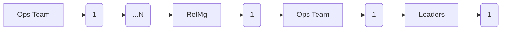
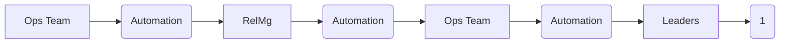

+++
title="On Creating Automation Products"
draft=true
+++

The most important skill I learned from [Jason Lantz](https://muselab.com/) was seeing *products* hiding inside business problems that are usually addressed with *tools*. It's the keystone of the success of the team that created [CumulusCI](https://cumulusci.readthedocs.io), [MetaDeploy](https://metadeploy.readthedocs.io/en/latest/), [Metecho](https://metecho.readthedocs.io/en/latest/), and a number of other automation-focused products for teams building on Salesforce. It's also a subtle distinction, between *products* and *tools*. I've been slowly turning over this attempt to elucidate that distinction and how it's brought into practice for most of 2023.

I'm going to frame this as two sets of threes: three shapes that an automation effort can take, and three perspective shifts that stakeholders move through in an automation effort. Jason might articulate this quite differently than I do: the formulation here is mine, but the vision is his.

## Automation Processes

Suppose you have a business process in place. It's entirely manual, labor-intensive, and involves person-to-person handoffs between at least three different stakeholders. How do you approach automating that process?

I've seen at least three paradigms for how this goes.

### Take a manual process and automate the individual steps.

Each of the stakeholders shown in the process above has a series of manual steps to execute. Those sub-processes can be arbitrarily complex; perhaps the Ops Team has a deeply branching workflow that responds to the outcomes of the steps they execute or the conditions on the ground. Perhaps different layers of leadership are engaged based on the status of the process.

What's structurally important here is that each stakeholder owns moving the process forward step by painstaking step: click button in System A; complete data entry; update record to Closed; enter data in System B; submit approval documentation... And on and on.

When a process is in this state, it's common for users to do a great deal of context-switching or waiting for a step to complete so that they can initiate a next step. Out-of-band information transfers between different users is also common, as are high-attention monitoring routines that reflect low overall confidence in the process.

One way of approaching an automation project in the context of this process is to automate those individual step sequences.

Usually, this approach means there are still people's hands on the keyboard - they're just running one command instead of 20. Cost improvement can be significant. The capacity of the Ops team might double or triple if they didn't have to be hands-on with each individual step or mediate the transitions between steps that they own.

The big problem with this approach is that it often leaves transformative opportunities on the table.

Given that limitation, a key question is whether effort invested on this type of automation is wasted or can form an incremental step towards a deeper goal. There's no global answer; it's case-specific. Broadly, automation capabilities - like software that orchestrates a sequence of steps - _may_ be reusable as a program moves to levels (2) and (3). However, some of these capabilities might become irrelevant as the overall shape of the process changes.

Further, pursuing this type of automation may necessitate investment that is always going to be wasted. For example, engineering that's dedicated to managing hand-offs between various stakeholders or notifications of individual step statuses is likely to be discarded in a level (2) or (3) solution.

It can be very tempting to over-invest on this type of process automation. Giving in to that temptation risks reifying inefficiencies permanently, instead of investing a similar level of effort to wipe them out.

### Automate the outcome of the process, which might radically change its shape.

Submerge all of those operational touchpoints! Automate the journey between the start and end of the process, _proactively_ pulling in users only when their intervention is needed. Start thinking in dashboards instead of buttons, and monitoring failures instead of operations. Assume that the process succeeds, and notify only when it doesn't.

This is where you start to get transformative change: humans freed to do creative, strategic work instead of operations.

### Discover and automate the ultimate business goal of the process, which might entail deleting the process entirely.

What if the end of the process isn't really the end - the goal - of the whole shebang? The most satisfying insight can be that the entire process does not need to exist. Take a different path - a shortening of the way, if you will - to achieve that larger outcome. That change can reshape other processes around it, too.

## Perspective Shifts

Achieving these automation projects is a virtuous cycle with changing the perspectives of the stakeholders involved. 

### Hows to Whys to Hows

It is very common for operations teams and teams that are primarily focused on compliance objectives to have a strong focus on "how" a process is executed. That's not a critique; it's a fact of how many businesses structure those teams.

Understanding the hands-on reality of a process is an enormous asset. My team referred to this as a "practitioner mindset". It can also be an impediment. 

The first shift an automation project invites of its stakeholders is to move from "how" the process is done today, to "why" the process is done that way, and then to "how" the process _could_ be done. The touchpoint to allow this shift to happen is the next layer of goal.

With the first shift, you focus on value and outcome, rather than implementation. Implementation often becomes ossified: "we've always done it this way". It takes trust to make this shift, but that trust can be won by focusing on the shared value of the outcome.

### Keyholes

To move from a keyhole view of a business process or objective to a holistic one.

This is a common paradigm shift for teams with very mature manual processes that are executed at scale. Individual workers aren't privileged to see the whole; only their own parts.

With the second shift, you embrace all of the other people and data flows that accrue towards that shared goal.

### Generalization

To understand their process or challenge as an instance of a much more general one.

It's about seeing the haunting possibility inside a problem that's just barely the wrong shape, and those three shifts make it possible to realize the possibility.

With the third, 

## Tools and Products

The distinction between a *tool* and a *product* almost never has anything to do with scale, with technology stack, or with ... I can't think of a single instance when a colleague presented me with a business problem and the "product" answer was "Yeah, but let's do that at web scale", or "Yeah, but let's build it in React." You can build narrow, non-product solutions to business problems in any stack, and scale them as high as you want. They're still not products.

It's much more to do with how you frame what you are building. Are you going to the root of the business problem? Are you imagining the general problem of which this is an instance? Are you inviting, persuading, cajoling your stakeholders to reimagine how they could reach their goals? You're probably building a product. Are you reifying the way things are done today in code? Are you spending effort more on edge cases than capabilities? Do you understand the _what_, but not the _why_, of what you're creating? You're likely building a tool.

There's nothing wrong with building tools. Sometimes it's the right move: you can generate a lot of cost savings and business value, often at a relatively low upfront cost. But products are far more interesting. And in the best case, you can achieve a great deal more value, at only modest increase in total cost, and with significantly lower long-term costs.