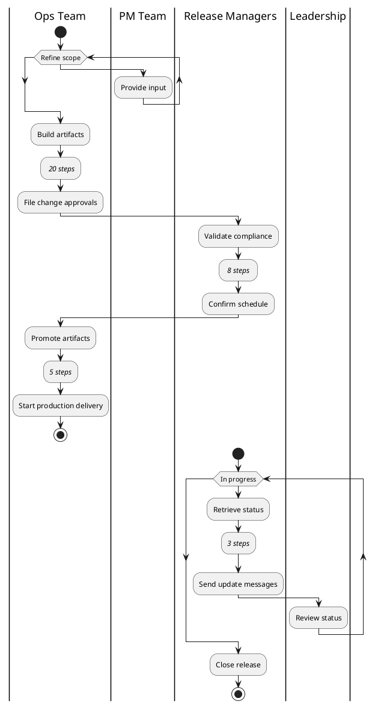
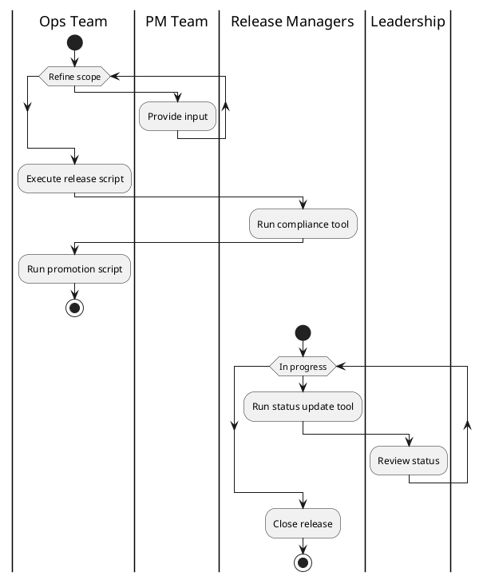
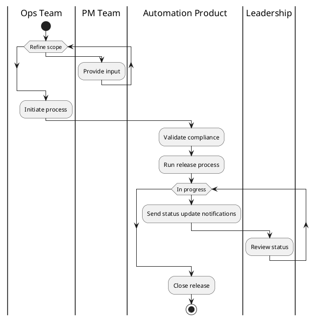
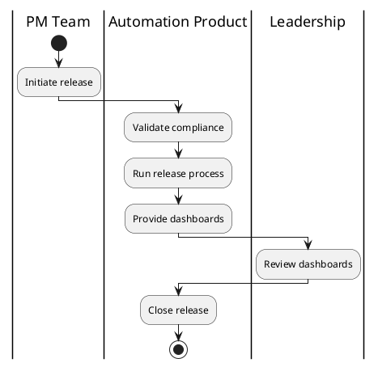

+++
title="On Creating Automation Products"
draft=true
+++

The most important skill I learned from [Jason Lantz](https://muselab.com/) was seeing *products* hiding inside business problems that are usually addressed with *tools*. That approahc drove the success of the team that created [CumulusCI](https://cumulusci.readthedocs.io), [MetaDeploy](https://metadeploy.readthedocs.io/en/latest/), [Metecho](https://metecho.readthedocs.io/en/latest/), and a number of other automation-focused products for teams building on Salesforce.

It's also a subtle distinction, between *products* and *tools*. I've been slowly turning over this attempt to elucidate that distinction and how it's brought into practice for most of 2023. It carries a lot of weight for me, and is closely tied to the successes of open source projects I've spent years of my career on. But the words "product" and "tool" mean different things to different folks. (You may have already objected to how I'm using them!) I'll ask your patience as we define these words through exploration.

I'm going to frame this along two different axes. The first is the shapes that an effort to automate a process can take, starting more towards a tool approach and ending more towards a product approach. The second is a group of perspective shifts that stakeholders move through in building a solution as it grows towards a product. I won't present a hard-and-fast definition of either a tool or a product, but highlight qualities that make a particular solution more tool-like or more product-like.

Jason might articulate this quite differently than I do: the formulation here is mine, but the vision is his.

## Automating Processes

Suppose you have a business process in place. It's entirely manual, labor-intensive, and involves person-to-person handoffs between at least four different stakeholders. How do you approach building a system that automates that process?

Throughout this essay, I'll refer to an example software release process. This example draws on real processes I've worked on and automated in the past, but I'll emphasize that I've constructed the example as an illustration and it does not represent actual process at any company.

Here's our process starting point.



There are four stakeholders in the current version of this process:

- the PM team, who lead creation of customer-facing features and works to set release scope with
- the Ops Team, who are responsible for extensive hands-on processes to create and deliver software artifacts.
- the Release Management team, who engage to validate compliance and sign-offs, and to communicate with
- the Leadership team, who stay abreast of operations that have the potential to impact high-value customers.

All four of these stakeholders pass information back and forth, engage at different stages of the process (sometimes at multiple stages), and perform stepwise, hands-on-keyboard work.

(The final stakeholder, of course, is the customer, who isn't shown on the process diagram but whose interests are pursued throughout).

I've seen at least three paradigms for an automation effort across a process like this goes. Here's how I think about those paradigms.

<aside>

I'm not calling out _who_ the people driving the automation effort are. It might be the Ops team, seeking to free themselves from manual effort and do more creative work; it might be leadership, trying to reduce costs and reallocate their staff; it might be Release Management, seeking to better guarantee their compliance requirements; it might be an external consulting or engineering team; or it might be a different stakeholder entirely.

</aside>

### Stepwise Automation

Each of the stakeholders shown in the process above has a series of manual steps to execute. Those sub-processes can be arbitrarily complex; perhaps the Ops Team has a deeply branching workflow that responds to the outcomes of the steps they execute or the conditions on the ground. Perhaps different layers of leadership are engaged based on the status of the process.

What's structurally important here is that each stakeholder owns moving the process forward step by painstaking step: click button in System A; complete data entry; update record to Closed; enter data in System B; submit approval documentation... And on and on.

When a process is in this state, it's common for users to do a great deal of context-switching or waiting for a step to complete so that they can initiate a next step. Out-of-band information transfers between different users is also common, as are high-attention monitoring routines that reflect low overall confidence in the process.

One way of approaching an automation project in the context of this process is to automate those individual step sequences.

Usually, this approach means there are still people's hands on the keyboard - they're just running one command instead of 20. Cost improvement can be significant. The capacity of the Ops team might double or triple if they didn't have to be hands-on with each individual step or mediate the transitions between steps that they own.



Notice what changes and what stays the same here. The start and end of the process, and touchpoints between stakeholders along the way, remain fixed. Between those fixed points, we compress and automate sequences of actions that previously required hands-on effort, nonproductive wait time, and context switching. That's a major improvement in the day-to-day experience and productivity of these stakeholders.

---

The primary challenge with this approach is that it often leaves transformative opportunities on the table. We've automated _the elements of the process_, but we haven't changed _the overall shape of the process_.

Given that limitation, a key question is whether effort invested on this type of automation is wasted or can form an incremental step towards a deeper goal. There's no global answer; it's case-specific. Broadly, automation capabilities - like software that orchestrates a sequence of steps - _may_ be reusable as a program moves towards outcome- or value-centered automation. However, some of these capabilities might become irrelevant as the overall shape of the process changes, and others may be built in ways that don't align to the needs of those more product-like approaches.

Pursuing this type of automation may necessitate investment that is always going to be wasted. For example, engineering that's dedicated to managing hand-offs between various stakeholders or notifications of individual step statuses is likely to be discarded in a solution where those touchpoints are handled differently or eliminated.

Stepwise automation _feels_ like an iterative approach towards a fully-automated business. In some circumstances, it can be. But in others, as discussed further below, a stepwise approach can leave much deeper and more impactful changes on the table. It can be very tempting to over-invest on stepwise automation. Giving in to that temptation risks reifying inefficiencies permanently, instead of investing a similar level of effort to wipe them out.

<aside>

Another common driver of a stepwise automation approach is a lack of overall business process ownership or high-level collaboration between stakeholders. A single stakeholder can be motivated to automate _their pieces_ of the process, but they may not not have the holistic view, the buy-in from other stakeholders, or the capacity to undertake a broader effort.

</aside>

This approach is *tool-like* because each stakeholder gets a piece of functionality they can grab off the shelf to improve their work lives. Those tools require the stakeholder's specific expertise and work within the confines of a specific hands-on process.

Could those tools be shared (or sold) to other users? Perhaps, but their audience and scope is limited by their tight binding to the existing business process. They're also hamstrung because they don't have a thoroughly defined interface: their "input" is simply where they're situated in the existing process, and their "output" what's needed for the next hands-on step.

### Outcome-Centered Automation

The first step we can take towards a *product-like* solution is expanding the scope of what we do beyond step sequences to the broader process structure. This is where we start to see transformative change to the business, over and above productivity gains (which themselves continue to grow!)

TODO: this needs a better intro. After we re-evaluate and automate all of the actions between the endpoints of the process, we might end up with something like this:



We've submerged all of those operational touchpoints and handoffs within the context of a single, integrated system that executes our previously-manual processes. The internal step sequences that are run by automation may have changed structure significantly; since the user interaction points have shifted, those step sequences are now abstracted from users' operations.

This approach _can_ be (but isn't necessarily) much more expensive than stepwise automation. For example, if our process includes both internal tools controlled by the stakeholders _and_ external platforms that are not so controlled, or that are difficult to integrate with effectively, the overall effort goes up steeply. Because engineering-oriented tools are often designed to integrate easily, they tend to be on the cheaper, smoother end of the spectrum.

Conversely, there are major savings available. In particular, the process involves fewer person-to-person handoffs where stakeholders are idle or context-switching. A hidden benefit of this transition is that this process scales with much lower expense in terms of staff time as the volume of business flowing through it grows. Where we might previously have needed to grow the Ops team more or less linearly as our volume grew, now we'll likely be growing that team sublinearly, and using their time primarily for higher-value engineering that multiples the efforts of other stakeholders rather than manual operations.

This approach moves towards the *product-like* end of the spectrum because it begins to allow users to think in terms of business outcomes rather than operational steps; because it encompasses a more-or-less complete business process in the scope of a cohesive software artifact; and because ... TODO

Outcome-centered automation can be a trap: it might look like you're done with automating the original business process, while still preserving some of its underlying inefficiencies. I've fallen into this trap multiple times. I built a software-release tool, for example, that covered perhaps 40% of the equivalent of our example release process here. It was extraordinarily successful at cutting down context switching and hands-on-keyboard time for my operations team, taking the process from something like eight person-days to maybe a person-hour and scaling way sublinearly. And it did a good job abstracting away the inner step sequences of the process.

But: it still operated in part on concepts from the "old way" of doing things. It didn't meet stakeholders where they were. It had a painful, complex, and highly technical interface. As a result, it required my ops team to do most of the hands-on operation of the system and to translate between the system and the other stakeholders.

That solution _was_ very product-like in some respects. It was reusable; it was decoupled from the hands-on details of the manual processes that preceded it; it was thoroughly tested and documented; it converted a huge amount of ops time into available engineering time. But those limitations of how it was conceived inside the broader scope of stakeholders meant it left some value on the table.

### Value-Centered Automation

What if the interfaces between the process and its stakeholders stem from obsolete expediencies, not from the real flow of business value? The most satisfying insight is that the entire process can be not just automated, but re-framed to "click" into place within the business context. At this level, the conversations we're having are generally not about technology. They're about goals and needs, where value is present, and about what drove the design of this process in the first place.

The messy edges of the process, the interfaces to stakeholders, are what we focus on here: how do we TODO

Here's one example of how value-centered automation could re-frame the original process.




We've made deep structural changes not just to how stakeholders participate in the process, but to who is engaged and to when and why they're engaged.

We've _disintermediated_ the delivery process by putting the PM team in control of their own release destiny. By allowing the team to define the scope of their proposed release as a first-class capability _of the solution that executes that release_, we've eliminated back-and-forth with the ops team, along with its attendant delays, mistakes, and context-switching. We've also more deeply engaged the PM team as owners of the full lifecycle of their product.

This disintermediation forces qualitative changes to how we implement the solution. Ops teams tend to absorb the friction of un-ergonomic or slightly misaligned technical interfaces. When we onboard stakeholders like the PM team, who have full-time jobs _other than_ operating this system, that no longer flies. Our solution _must_ provide an ergonomic, self-service experience that's accessible to stakeholders who are experts on the business process, but not on our solution. That's a *product-like* quality, and opens the door wider to sharing this solution with other stakeholders.

The ops team isn't an ops team anymore! They're now running engineering on the platform they built to support this process transformation. Similarly, the release management team now plays a role more of oversight and goal-setting, without hands-on interaction. We've freed those people to focus on strategy and on building enduring value for the business, instead of executing one-off, hands-on processes.

We start from a position of assuming the process succeeds, so we don't distract stakeholders with notifications that may not contain any actionable information. We notify only when we're _not_ meeting success criteria. Both leadership and our other stakeholders use dashboards pulled directly form the source of truth to assess long-term trends and metrics.

The upshot of all of these changes is that stakeholders across the landscape are enabled to bring their expertise directly to bear. We've wiped out most non-productive context switches, replaced proactive checks with reactive, failure-case-only review, and taught our system to meet stakeholders where they are.

This is a *product-like* solution. It maximizes the productivity and agency of all of the stakeholders, and it's primed to scale with our business _without_ adding head count just to execute operational processes.

## Perspective Shifts

Achieving automation projects like those described above is a virtuous cycle with changing the perspectives of the stakeholders involved. Shifting your perspective helps unlock higher-level process automation strategies, and building automation invites perspective shifts.

### Hows to Whys to Hows

It is very common for operations teams and teams that are primarily focused on compliance objectives to have a strong focus on "how" a process is executed. That's not a critique; it's a fact of how many businesses structure those teams and the imperatives to which those teams respond.

Understanding the hands-on reality of a process is an enormous asset. My team referred to this as a "practitioner mindset", and we saw it as critical to our ability to design products that serve the actual needs of users in a extremely complex problem space.

A practitioner mindset can also be an impediment. When stakeholders have a keyhole view (see the next section!) they often hold an explicit or implicit belief that the way the process runs today is the only viable shape of the process. "We've always done it this way" leads to "We have to do it this way". These beliefs create resistance to change, and even resistance to discussing change.

The first shift an automation project invites of its stakeholders is to move from "how" the process is done today, to "why" the process is done that way, and then to "how" the process _could_ be done. It breaks those assumptions that today's way is the only way, and refocuses conversations around outcomes instead of hands-on minutia.

A practitioner mindset can show its value again during this conversation. Because "whys" often stem from values, the conversation can be self-grounding: stakeholders who might otherwise resist change see their goals reflected in the articulation of "why", and become more open to reconsidering "how". Focusing on the shared value of the outcome creates trust.

Establishing a new "how" opens up possibilities to go beyond stepwise automation to outcome- or value-centered automation.

### Disintermediation and Self-Service by Default

It's tempting to privilege, in a fully-automated process, the same stakeholders who were privileged in the earlier version of the process. In the examples above, the Ops Team fits this paradigm. This isn't always the right choice.

The Ops Team hold privileged access to perform certain software release operations, which makes them an intermediary between the PM Team (who have the knowledge of what is being delivered and why) and the customers who consume that value. That privilege isn't misplaced; it's given to the Ops Team based on their specific skillsets and likely also to meet compliance goals. But those driving factors aren't the ultimate values stemming from this process, and that means they can be reconsidered as the process itself changes shape.

In the value-centered automation paradigm discussed above, we made a point of disintermediating the relationship between those two endpoints, the PM team and the customer. The ops team isn't required any more to work in a go-between capacity, because they created a new kind of value: they built a product that allowed the value-creating PM team to self-service delivery to their customers.

Disintermediation and self-service are hallmarks of a product approach to automation. When stakeholders are empowered in this way, they both get pragmatic improvements - fewer context switches, more productive hours in their days - but also opportunities to reconsider the overall shape of a process. Those outcome- and value-centered automation types that are exposed can offer far greater scope for productivity improvement and cost reduction.

### Keyholes to Vistas

Teams with mature processes and scale often end up reflecting the structure of their processes in the structure of the team itself. A role is defined, for example, that executes specific steps within the process. Staff members in that role are trained on their steps, and they're very effective at executing them. They have a keyhole view of the overall business process: they may have a sense of the "why" for their specific role, but they aren't privileged to see the whole process or the ultimate outcomes and values.

When stakeholders come to an automation process with a keyhole view, they tend to have a strong "how" mindset. This can produce resistance to change, as well as limiting the ability of these stakeholders to contribute in reimagining their process. Stakeholders who bring a practitioner mindset rooted in their expertise can struggle to envision a new "how", even if they are motivated to do so, because their keyhole view limits their ability to see the whole. As a result, these stakeholders are often aligned to stepwise automation.

Helping stakeholders widen their keyhole perspectives to a vista across the entire business process allows them to make that shift and consider other automation approaches that result in transformative change. Here, the discussions embrace all of the other people and data flows that accrue towards the shared goal.

It is a fact that, in mature teams with ossified, keyhole roles, automation projects sometimes also have a moral or existential dimension. Are all of those step-executors going to be laid off when their steps are automated? Or even more so, if we reimagine the process and _stop doing those steps_ the way they're done today? You cannot get buy-in from your stakeholders unless you've established trust and shown that there is a place for those people in the new process shape you're imagining together.

### Problem Instances to Problem Classes

The final conceptual shift comes when you're haunted by the general use case tucked inside a specific business problem.

Products are about generality: how can we serve many people who have instances of the same problem with a single investment of effort? Automation's always asymmetrical; those who need it are more numerous than those who build it. When we go to build automation, we want to get the maximum value for our effort. We do that by asking what the more generalized need is inside each specific problem, such that our work can be specialized to serve more than just the use case in front of us.

This shift arises in multiple contexts.

One is a will from the automators. Do we want to automate this sequence of steps that is done by one company, today? Or do we want to generalize how we approach that sequence of steps, and build automation that can both evolve with my company and potentially serve other teams too? That's a tool/product decision, but it's also a stepwise/outcome/value decision.

Another is a will from the stakeholders. Am I willing to rethink how I do things, even just a little, in the name of ending up with a better solution?

There is a fork in the road:

1. You can automate the process _exactly_ as executed today and come out the other side with a tool. The tool can likely be used only by your company, and will need to be continuously updated to match the process's evolution.
2. or you can tweak the process just a bit and see it become an instance of a process.

Trust plays a critical role here too. When business-oriented stakeholders and technology-oriented stakeholders trust each other, based on a shared goal, and communicate with each other at a level beyond the simplistic notion of "requirements", they can work together to create more value.

TODO: tighten up this section.

## Tools and Products

The distinction between a *tool* and a *product* almost never has anything to do with scale or with technology stack. I can't think of a single instance when a colleague presented me with a business problem and the "product" answer was "Yeah, but let's do that at web scale", or "Yeah, but let's build it in React." You can build narrow, non-product solutions to business problems in any stack, and scale them as high as you want. They're still not products.

The distinction has far more to do with how you frame what you are building. Are you going to the root of the business problem? Are you imagining the general problem of which this is a specific instance? Are you inviting, persuading, cajoling your stakeholders to reimagine how they could reach their goals? You're probably building a product. Are you reifying the way things are done by hand today in code? Is what you're building fragile to small changes in business process or stakeholder requests? Do you understand the _how_, but not the _why_, of what you're creating? You're likely building a tool.

There's nothing wrong with building tools. Sometimes it's the right move: you can generate a lot of cost savings and business value, often at a relatively low upfront cost. But products are far more interesting. Building a tool comes with a more-or-less fixed ceiling on the value you can create. Products don't. Products are more rewarding for the people who create them, and they're often more rewarding for the business as a whole too.

```graph
Show cost and value curves for products and tools
```

So that's my pitch. Build products. Build tools where you need to, to buy yourself back time to build products. Think deeply about business problems and what's most real about them. Create trust between stakeholders. Bring a practitioner mindset, but also bring a "why on Earth do we do this?" mindset. And if you don't have scope to do those things, go somewhere you will.
