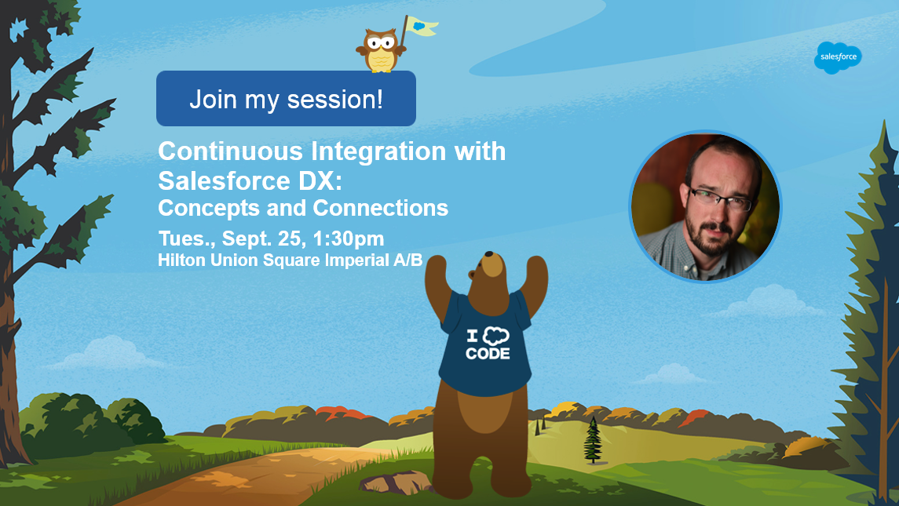

+++
title="Continuous Integration with Salesforce DX: Concepts and Connections"
aliases=["2018/10/08/dreamforce-retro.html", "2018/09/21/dreamforce-continuous-integration.html"]
[extra]
venue="Dreamforce '18"
[extra.resources.video]
youtube_id="8obwIwvzmMw"
+++

My Dreamforce '18 session, [Continuous Integration and Salesforce DX: Concepts and Connections](https://success.salesforce.com/sessions?eventId=a1Q3A00001XoCSUUA3#/session/a2q3A000001WVMwQAO), had over 350 registrants and yielded some excellent and important questions about moving to Salesforce DX practice. It was a great experience, and the talk is now available on [YouTube](https://www.youtube.com/watch?v=8obwIwvzmMw).

