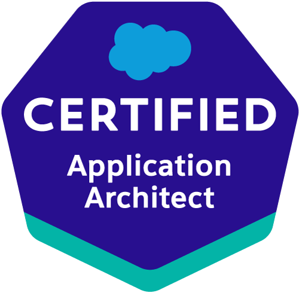
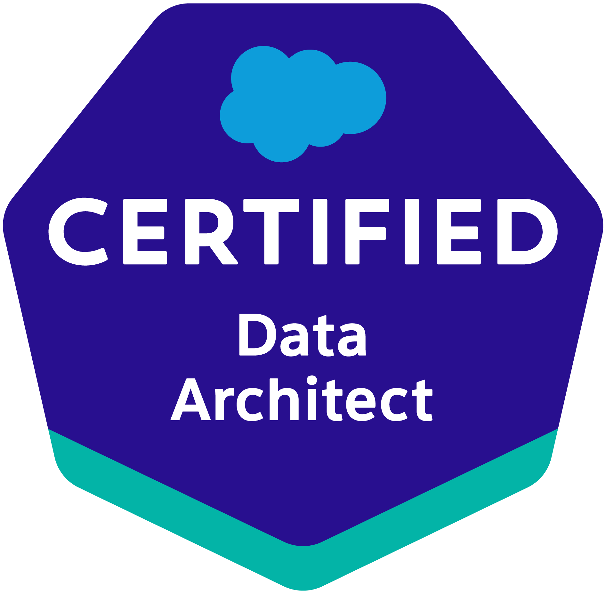
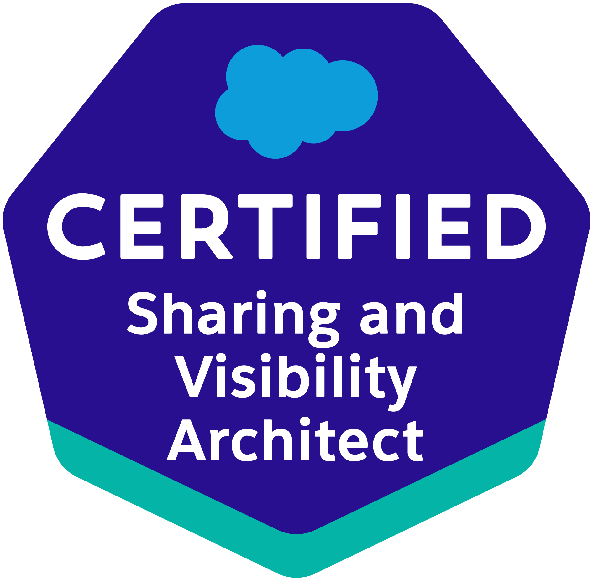
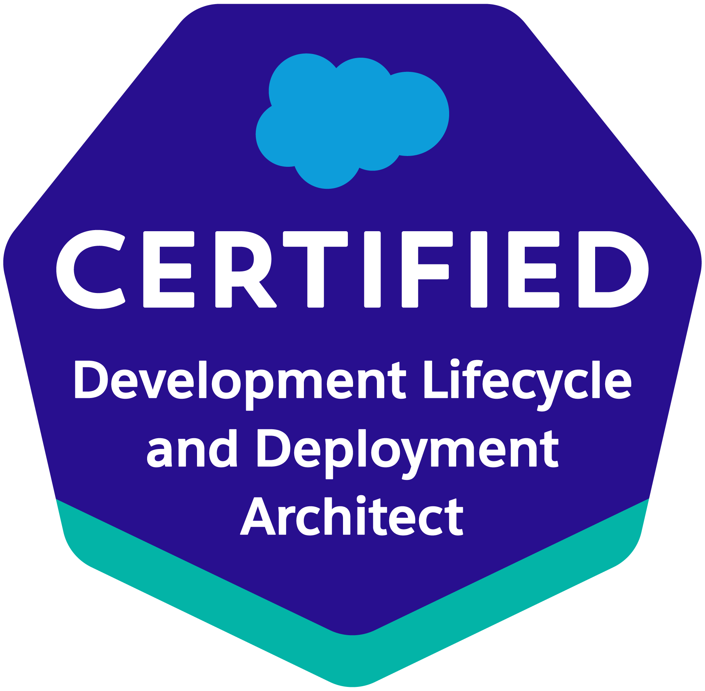
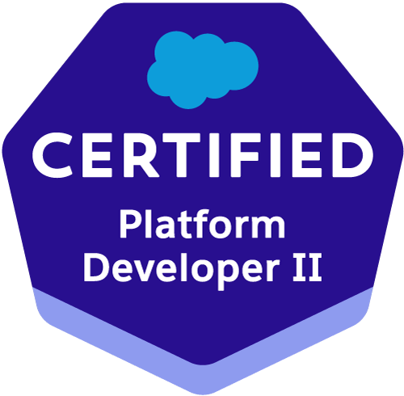
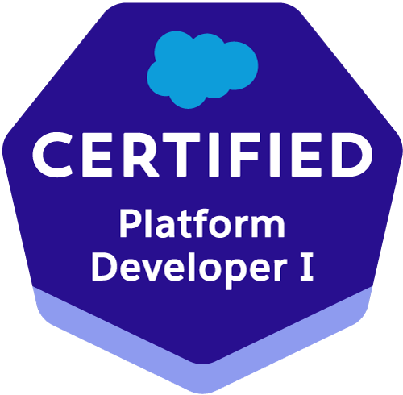
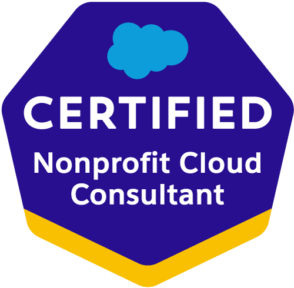
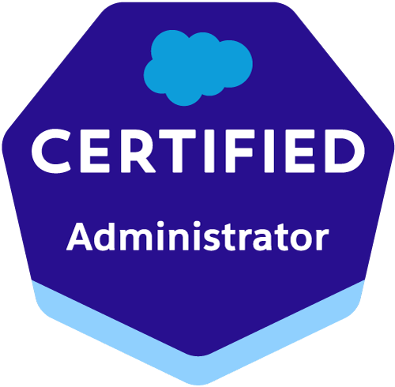

<h1 class="print-title">David Reed &nbsp;&nbsp; | &nbsp;&nbsp; Engineer, architect, communicator</h1>

<h2>Contact</h2>

<a
    id="email-link"
    class="icon"
    title="Email"
    aria-label="Email"
    href="{{ site.links.email }}">
<i class="fas fa-envelope"></i>
<code>david@ktema.org</code></a>

<a
    id="web-link"
    class="icon"
    title="Website"
    aria-label="Website"
    href="{{ site.author.url }}">

<i class="fas fa-home"></i><code>ktema.org</code>
</a>

<a
    id="github-link"
    class="icon"
    title="GitHub"
    aria-label="GitHub Profile"
    href="{{ site.links.github }}">
<i class="fab fa-github"></i><code>davidmreed</code>
</a>

<a
    id="stackexchange-link"
    class="icon"
    title="Salesforce Stack Exchange"
    aria-label="Salesforce Stack Exchange Profile"
    href="{{ site.links.sfse }}">
<i class="fab fa-stack-exchange"></i><code>david-reed</code>
</a>

<a
    class="icon"
    title="Twitter"
    aria-label="Twitter Profile"
    href="{{ site.links.twitter }}">
<i class="fab fa-twitter"></i><code>@aoristdual</code>
</a>

<a
    class="icon"
    title="LinkedIn"
    aria-label="LinkedIn Profile"
    href="{{ site.links.linkedin }}">
<i class="fab fa-linkedin"></i>
<code>davidreed-salesforce</code></a>

<a
    class="icon"
    title="Trailblazer Community"
    aria-label="Trailblazer Community Profile"
    href="{{ site.links.tbc }}">
<i class="fab fa-salesforce"></i><code>davidmreed</code>
</a>

<h2>Certifications</h2>

  <section class="cards">
    

      <h2>Top Skills</h2>
      <ul style="list-style-type: none; margin: 0; padding: 0; padding-bottom: 1rem;">
        <li>Salesforce architecture, development, ISV packaging</li>
        <li>DevOps and automation for Salesforce</li>
        <li>Python, Rust, JavaScript engineering</li>
        <li>Technical leadership, education, developer relations</li>
      </ul>
    

    

      <h2>Community</h2>
      <ul style="list-style-type: none; margin: 0; padding: 0; padding-bottom: 1rem;">
        <li>Elected moderator, Salesforce Stack Exchange, 2019-</li>
        <li>Salesforce MVP alumnus, 2019</li>
        <li>Frequent community speaker</li>
        <li>Open source maintainer and contributor</li>
      </ul>
    

    

      <h2>Technologies</h2>
      

      Python 
      Rust 
      Apex 
      JavaScript 
      LWC 
      Salesforce&nbsp;DX 
      CumulusCI
      Managed&nbsp;Packaging
      NPSP 
      CI/CD
      Django 
      FastAPI 
      Heroku 
      SQL 
      Docker
      GitHub&nbsp;Actions
      CircleCI
      

    

    

    <h2>Education</h2>
        

         <abbr>M.A.</abbr>, Ancient Greek, Florida State University (2009-2011). 
          <abbr>B.A.</abbr>, Liberal Arts, St. John's College (2005-2009).
        

    

  </section>

## Recent Experience

### Interim Product Manager, CumulusCI Suite, Salesforce (2021-)

- Owned the vision and roadmap for suite of 6 applications.
- Set engineering priorities for scrum team of 13.
- Coordinated requirements with multiple stakeholder teams across business units.

### Lead Member of Technical Staff, Salesforce (2019-)

- Created new CI/CD and build automation solutions using CumulusCI, Salesforce DX, Python, Robot Framework, and Metadata and Tooling APIs.
- Architected MetaPush application for safe, performant ISV push upgrades.
- Executed build, release, and delivery processes for more than 50 Salesforce managed packages reaching tens of thousands of customers.
- Drove implementation of 2GP builds and tests across more than 30 projects.
- Directly supported 5+ product teams as packaging SME.
- Designed and built Metadata ETL framework for safe org configuration.
- Built intelligent data load engine, yielding 500% speed increases.
- Coauthored 6 Trailhead modules and thousands of words of documentation.
- Presented over 20 public-facing talks, articles, and blog posts evangelizing CumulusCI and related topics.
- Led Salesforce.org Permissions Working Group and CumulusCI Champions Council.

### Salesforce Application Architect, Radian Group (2017-2019)

- Developed custom Lightning app to manage intake of over $10M/mo insurance premiums.
- Onboarded 3 major organizations to Lightning Sales Cloud.
- Built backend and user-facing functionality in Apex, LWC, and Visualforce.
- Planned and executed Salesforce-to-Salesforce org and data merge for corporate acquisition.
- Developed new ETL solution in Python for sandbox seeding & data transfer.

### Salesforce Developer, American Civil Liberties Union (2017)

- Designed and built solutions on Salesforce and NGO Connect, including triggers, Apex batch processes, Queueable Apex, Visualforce pages, and Python API integrations.
- Applied enterprise/LDV patterns to handle 50 million+ record volume, 300,000+/mo donations.
- Built monitoring & config management apps in Apex, Visualforce, JavaScript with Salesforce DX.

### Data Systems Manager, Santa Fe Institute (2015–2017)

- Led transition from Blackbaud Raiser's Edge to Salesforce, using Nonprofit Success Pack.
- Architected and built applications in Apex and Visualforce to support 5 departments.
- Migrated 3 legacy systems and data, from FileMaker, PHP/MySQL, and 3rd-party cloud platform.
- Designed and built custom data import and deduplication solution in Python and Flask.
- Supervised associate-level staff member.

## Presentations and Open Source Projects 

- Author of [Baris](https://github.com/davidmreed/baris), an open-source Rust crate for async, parallelized Salesforce integrations.
- Author of [Amaxa](https://github.com/davidmreed/amaxa), an open-source Python Salesforce ETL tool for multi-object data loads.
- Author of [Bibliothekai](https://bibliothekai.ktema.org), an open-source app built in Python, Django, and Lightning Web Components for cataloging and reviewing translations of classical texts.
- Dozens of public presentations (see [ktema.org/publications](https://ktema.org/publications) for complete CV).
